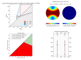
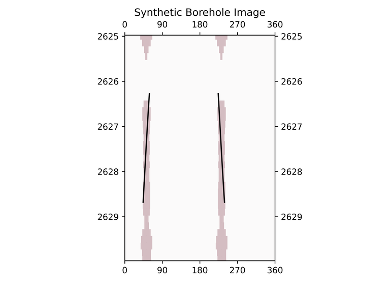
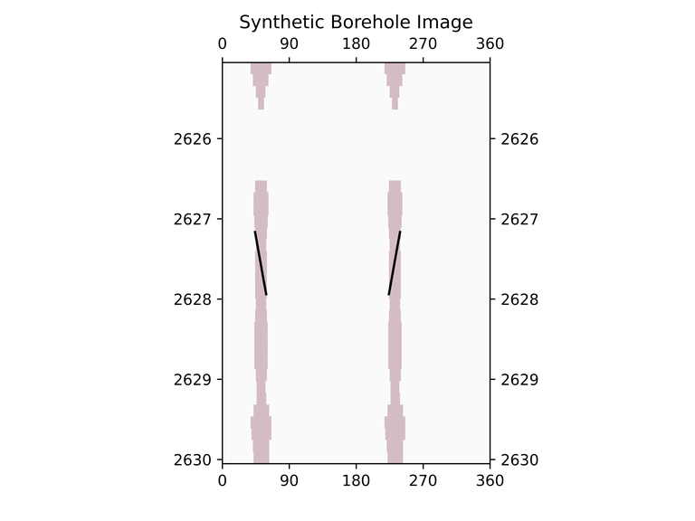
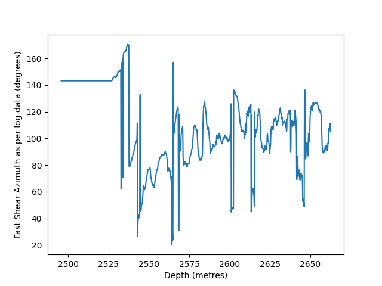
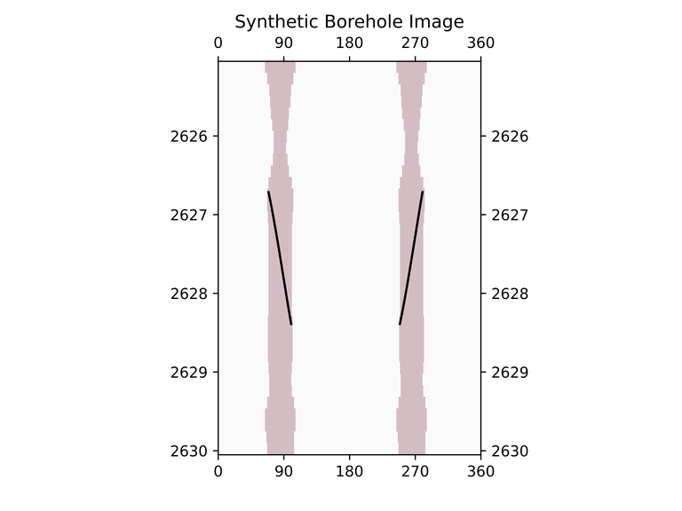
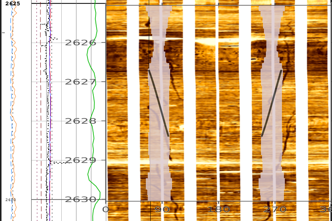

Real World Example: Eos Well
============================

This case study demonstrates the iterative process of geomechanical analysis using the Northern Lights dataset (courtesy of Equinor). We'll explore how different modeling assumptions affect our results and show the importance of calibrating models with observed data.

Downloading the Data
--------------------

Some extra packages are required to download using python, else we can use Azure Storage explorer to get the data using the shared access signature URI.

.. code-block:: bash
   
   pip install azure-storage-blob tqdm

Now we can use the following python script to download the data to be used in this example.

.. code-block:: python

   from azure.storage.blob import ContainerClient
   import os
   from tqdm import tqdm

   # use the shared access signature URI from EquiNor data sharing website after signing in.
   # To create this token, go to https://data.equinor.com, and log in (either as employee or as b2c) (ensure pop-ups are allowed).
   # You can create your account at this stage using your mail ID.
   # Then browse to the dataset in question, in this case Northern Lights (https://data.equinor.com/dataset/NorthernLights).
   # The token ("shared access signature URI") will be found at the bottom of the page, in the "Data links" section.
   # The token's validity is of limited time (a month or so), you can get a new token by following the steps above once the token expires.

   # Initialize the ContainerClient
   container_client = ContainerClient.from_container_url("your/shared/access/signature/uri/here")
      
   # List of files to download
   files_to_download = [
      "31_5-7 Eos/06.Wireline_Log_Data/WL_RAW_AAC-ARLL-CAL-DEN-GR-NEU_RUN6_EWL_2.DLIS",
      "31_5-7 Eos/02.Drilling_and_Completion/CORING_2020-01-14_REPORT_1.PDF",
      "31_5-7 Eos/03.Directional_Surveys/WELLPATH_COMPUTED_1.ASC",
      "31_5-7 Eos/03.Directional_Surveys/WELLPATH_ORIGINAL_SURVEY_POINTS_1.ASC", 
      "31_5-7 Eos/11.Core_Data/CORE_CONV_2020-05-25_REPORT_1.PDF", 
      "31_5-7 Eos/12.Geology_Data_and_Evaluations/31_5-7_Formation_Tops_FWR_Sept2020.xlsx"
   ]

   # Specify output directory with a separate variable
   output_path = "."  # Relative to where the script is run from

   # Create output directory if it doesn't exist
   if not os.path.exists(output_path):
      os.makedirs(output_path)
      print(f"\nCreated output directory: {output_path}")

   # Download each selected file
   for blob_path in files_to_download:
      # Extract just the filename for local saving
      local_filename = os.path.join(output_path, os.path.basename(blob_path))
      
      # Get blob client and properties
      blob_client = container_client.get_blob_client(blob_path)
      properties = blob_client.get_blob_properties()
      file_size = properties.size
      
      print(f"\nDownloading {os.path.basename(blob_path)} ({file_size/1024/1024:.2f} MB)...")
      
      # Download with progress bar
      with open(local_filename, "wb") as download_file:
         download_stream = blob_client.download_blob()
         
         # Using tqdm for progress reporting
         progress_bar = tqdm(total=file_size, unit='B', unit_scale=True)
         
         # Download in chunks to show progress
         chunk_size = 1024 * 1024  # 1MB chunks
         for chunk in download_stream.chunks():
               download_file.write(chunk)
               progress_bar.update(len(chunk))
         
         progress_bar.close()
      
      print(f"Successfully downloaded {os.path.basename(blob_path)}")

   print("\nAll files downloaded successfully!")

The downloaded data will be used in the following example, with some files created based on the information downloaded (by changing the file types and format as required)
Some of the data required for this example has strict format requirements, we provide example versions with current formatting in the following repository: https://github.com/GeoArkadeep/supporting-data-for-EOS-Northern-Lights

.. code-block:: python

   # Load support data

   import pandas as pd

   survey = pd.read_csv('https://raw.githubusercontent.com/GeoArkadeep/supporting-data-for-EOS-Northern-Lights/main/Deviation.csv')
   print(survey)
   formations = pd.read_csv('https://raw.githubusercontent.com/GeoArkadeep/supporting-data-for-EOS-Northern-Lights/main/NorthernLights-31_5-7.csv')
   print(formations.head())
   print(list(formations))

   """
      Top TVD  Number                  Formation Name  ...  DXP_NCT  DXP_exp  DXP_ML
   0      488       1  URU(Upperregionalunconformity)  ...      NaN      NaN     NaN
   1      772       2                           Skade  ...      NaN      NaN     NaN
   2     1144       3              HordalandGreenClay  ...      NaN      NaN     NaN
   3     1442       4                          Balder  ...      NaN      NaN     NaN
   4     1530       5                            Sele  ...      NaN      NaN     NaN

   [5 rows x 24 columns]
   ['Top TVD', 'Number', 'Formation Name', 'GR Cut', 'Struc.Top', 'Struc.Bottom', 'CentroidRatio',
   'OWC', 'GOC', 'Coeff.Vol.Therm.Exp.', 'SHMax Azim.', 'SVDip', 'SVDipAzim', 'Tectonic Factor',
   'InterpretedSH/Sh', 'Biot', 'Dt_NCT', 'Dt_ML', 'Res_NCT', 'Res_Exp', 'Res_ML', 'DXP_NCT', 'DXP_exp', 'DXP_ML']
   """
   # The formations data, if provided, must contain 24 columns in this exact order.
   # If values are unavailable or we wish to use the defaults/constant values, it is fine to leave them blank

   ucs = pd.read_csv('https://raw.githubusercontent.com/GeoArkadeep/supporting-data-for-EOS-Northern-Lights/main/UCSdata.csv')
   print(ucs.head())
   """
      2643.08  35
   0  2644.02  34
   1  2645.02  35
   2  2646.25  31
   3  2647.50  37
   4  2648.55  34
   """
   # The UCS data if provided, must be in MPa, with the depths in metres, TVD.

   imagelog = pd.read_csv('https://raw.githubusercontent.com/GeoArkadeep/supporting-data-for-EOS-Northern-Lights/main/31_5-7_Image.csv')
   #Image log is available and features are visible, so we will use them here.

Initial Setup
-------------

First, let's import the required packages:

.. code-block:: python

    import stresslog as lst
    from welly import Well

Loading Well Data
-----------------

Here's how we load our well data:

.. code-block:: python

   alias = {
      "sonic": ["none", "DTC", "DT24", "DTCO", "DT", "AC", "AAC", "DTHM"],
      "ssonic": ["none", "DTSM","DTSH_FINAL"],
      "gr": ["none", "GR", "GRD", "CGR", "GRR", "GRCFM","GR_EDTC"],
      "resdeep": ["none", "HDRS", "LLD", "M2RX", "MLR4C", "RD", "RT90", "RLA1", "RDEP", "RLLD", "RILD", "ILD", "RT_HRLT", "RACELM"],
      "resshal": ["none", "LLS", "HMRS", "M2R1", "RS", "RFOC", "ILM", "RSFL", "RMED", "RACEHM", "RXO_HRLT"],
      "density": ["none", "ZDEN", "RHOB", "RHOZ", "RHO", "DEN", "RHO8", "BDCFM"],
      "neutron": ["none", "CNCF", "NPHI", "NEU", "TNPH", "NPHI_LIM"],
      "pe": ["none", "PEFLA", "PEF8", "PE"]
   }

   # Load well log data
   vertwell = lst.get_well_from_dlis('WL_RAW_AAC-ARLL-CAL-DEN-GR-NEU_RUN6_EWL_2.DLIS', aliases=alias, step=0.147)
   # we could have used aliases=None (which is the default) but that would have returned ALL the channels in the dlis creating a huge las file which slows the analysis somewhat.
   # also steps less than 0.15m will be reset to 0.15m, this is a protective measure, upsampling data beyond it's natural resolution with this method creates artefacts and other issues. 

Iteration 1: Vertical Well
-----------------------------------------

Our first analysis assumes a vertical well:

.. code-block:: python

   # Set up mud KB, GL, BHT and LOT values
   attrib = [50, -307, 0, 0, 0, 100, 0, 0]
   xlot = [[1.43, 2582.9]]
   # Create vertical well model
   wellwithoutdeviation = lst.getwelldev(wella=vertwell, deva=None)
   # Run initial analysis
   output = lst.compute_geomech(
      wellwithoutdeviation, 
      attrib=attrib,
      rhoappg=17.33,
      a=0.8,
      lamb=0.00075,
      forms=formations,
      UCSs=ucs,
      writeFile=True,
      user_home="./output",
      offset=91,
      dip_dir=180,
      dip=2,
      doi=2627.5,
      mwvalues=[[1.26, 0.0, 0.0, 0.0, 0.0, 0]],
      plotstart=2560,
      plotend=2660,
      mudtemp=35,
      fracgradvals=xlot,
   )

   # Let's check the "PlotAll.png" in the output/Stresslog_Plots to see the zobackogram, stability plot, sanding risk plot and synthetic borehole image
   # Let's also compare the "PlotBHI.png" to the actual image log of the Northern Lights Eos well

   # While the inbuilt plotting tools work, the main output is the dataframe (and the las string generated from the dataframe and other info)
   
   print(output[0])
   print(list(output[0]))
   """
                     DEPT           DTCO  ...  Shear_Modulus     Bulk_Modulus
   0         0.0000000000            NaN  ...   0.0000000000     0.0000000000
   1         0.1470000000            NaN  ...   0.0000000000     0.0000000000
   2         0.2940000000            NaN  ...   0.0000000000     0.0000000000
   3         0.4410000000            NaN  ...   0.0000000000     0.0000000000
   4         0.5880000000            NaN  ...   0.0000000000     0.0000000000
   ...                ...            ...  ...            ...              ...
   18922  2781.5339999988  87.2171899945  ...   1.8637329689  5133.1104753863
   18923  2781.6809999988  87.7187699958  ...   1.8287958424  4848.8212822883
   18924  2781.8279999988  88.2238099957  ...   1.7944750138  4796.3186612756
   18925  2781.9749999988  88.4480199981  ...   1.7795074291  4957.0108813337
   18926  2782.1219999988  88.3849000005  ...   0.0000000000     0.0000000000

   [18927 rows x 38 columns]
   ['DEPT', 'DTCO', 'DTSM', 'GR', 'NPHI', 'RLA1', 'RXO_HRLT', 'RHOZ', 'PEFLA',
   'MD', 'TVDM', 'INCL', 'AZIM', 'ShaleFlag', 'RHO', 'OBG_AMOCO', 'DTCT', 'PP_GRADIENT',
   'SHmin_DAINES', 'SHmin_ZOBACK', 'FracGrad', 'FracPressure', 'GEOPRESSURE', 'SHmin_PRESSURE', 'SHmax_PRESSURE',
   'MUD_PRESSURE', 'OVERBURDEN_PRESSURE', 'HYDROSTATIC_PRESSURE', 'MUD_GRADIENT', 'S0_Lal', 'S0_Lal_Phi', 'UCS_Horsud',
   'UCS_Lal', 'Poisson_Ratio', 'ML90', 'Youngs_Modulus', 'Shear_Modulus', 'Bulk_Modulus']
   """

   print(output[1][:2500])
   """
   ~Version ---------------------------------------------------
   VERS.   2.0 : CWLS log ASCII Standard -VERSION 2.0
   WRAP.    NO : One line per depth step
   DLM . SPACE : Column Data Section Delimiter
   ~Well ------------------------------------------------------
   STRT.m     0.00000 : 
   STOP.m  2782.12200 : 
   STEP.m     0.14700 : 
   NULL.      -999.25 : Null value
   UWI .       31/5-7 : 
   WELL.       31/5-7 : 
   SRVC. Schlumberger : 
   COMP.      Equinor : 
   FLD .          Eos : 
   ~Curve Information -----------------------------------------
   DEPT                .m      : 
   DTCO                .us/ft  : 
   DTSM                .us/ft  : 
   GR                  .gAPI   : 
   NPHI                .m3/m3  : 
   RLA1                .ohm.m  : 
   RXO_HRLT            .ohm.m  : 
   RHOZ                .g/cm3  : 
   PEFLA               .       : 
   MD                  .m      : 
   TVDM                .m      : 
   INCL                .       : 
   AZIM                .       : 
   ShaleFlag           .       : 
   RHO                 .gcc    : 
   OBG_AMOCO           .gcc    : 
   DTCT                .       : 
   PP_GRADIENT         .gcc    : 
   SHmin_DAINES        .gcc    : 
   SHmin_ZOBACK        .gcc    : 
   FracGrad            .gcc    : 
   FracPressure        .psi    : 
   GEOPRESSURE         .psi    : 
   SHmin_PRESSURE      .psi    : 
   SHmax_PRESSURE      .psi    : 
   MUD_PRESSURE        .psi    : 
   OVERBURDEN_PRESSURE .psi    : 
   HYDROSTATIC_PRESSURE.psi    : 
   MUD_GRADIENT        .gcc    : 
   S0_Lal              .       : 
   S0_Lal_Phi          .       : 
   UCS_Horsud          .mpa    : 
   UCS_Lal             .mpa    : 
   Poisson_Ratio       .       : 
   ML90                .gcc    : 
   Youngs_Modulus      .       : 
   Shear_Modulus       .       : 
   Bulk_Modulus        .       : 
   ~Params ----------------------------------------------------
   SMALL_RING     .in 8.0 : Caliper Calibration Small Ring
   CALI_LIN_OFFSET.m  0.0 : Caliper Linear Offset
   ~Other -----------------------------------------------------
   ~ASCII -----------------------------------------------------
      0.00000    -999.25    -999.25    -999.25    -999.25    -999.25    -999.25    -999.25    -999.25    0.00000    0.00000    0.00000    0.00000    0.00000    -999.25    -999.25   60.00000    -999.25    -999.25    1.48043    -999.25    -999.25  436.74626    -999.25    -999.25    0.00000    0.00000    0.00000    1.26000    0.00000    0.00000    0.00000    0.00000    0.25000    0.51126    0.00000    0.00000    0.00000
      0.14700    -999.25    -999.25    -999.25    -999.25    -999.25    -999.25    -999.25    -
   """

In this first run, we've made several key assumptions:

- The well is perfectly vertical
- The SHmax azimuth is 91 degrees
- The stress tensor is tilted 2 degrees to the south

The results can be found in the ./output/Stresslog_Plots directory, where PlotAll.png shows the Zobackogram, stability plot, sanding risk plot, and synthetic borehole image.

.. image:: ../Figures/WellPlot.png
   :alt: Well Plot
   :width: 600px
   :align: center

.. image:: ../Figures/overlay.png
   :alt: Overlay Plot
   :width: 600px
   :align: center

Iteration 2: Incorporating Well Deviation
-----------------------------------------------

Looking at the survey data, we notice that the well isn't perfectly vertical. At 2621.97m, there's a slight deviation with an inclination of 0.60° at an azimuth of 40.11°. Could this slight departure from verticality explain the en-echelon fractures we observe?

.. code-block:: python

    # Create deviated well model
    wellwithdeviation = lst.getwelldev(wella=vertwell, deva=survey)
    # Run analysis with deviation but no stress tensor tilt
    output = lst.compute_geomech(
        wellwithdeviation,
        attrib=attrib,
        rhoappg=17.33,
        lamb=0.00075,
        forms=formations,
        UCSs=ucs,
        writeFile=True,
        user_home="./output0",
        offset=91,
        dip_dir=180,
        dip=0,
        doi=2627.5,
        mwvalues=[[1.26, 0.0, 0.0, 0.0, 0.0, 0]],
        plotstart=2560,
        plotend=2660,
        mudtemp=35,
        fracgradvals=xlot
    )

These results can be found in the ./output0/Stresslog_Plots directory, as plotBHI.png (we will be using different output directories throughout these examples, as set by the user_home parameter. In regular useage, the user_home defaults to ~/Documents, so users can find their results there by default).

We observe that this model produces fractures with closure directions opposite to what we see in the actual image logs. This suggests our assumption about well deviation being the primary factor might be incorrect.

Iteration 3: Reintroducing Stress Tensor Tilt
------------------------------------------------------

Let's try reintroducing the stress tensor tilt while keeping the well deviation:

.. code-block:: python

    output = lst.compute_geomech(
        wellwithdeviation,
        attrib=attrib,
        rhoappg=17.33,
        lamb=0.00075,
        forms=formations,
        UCSs=ucs,
        writeFile=True,
        user_home="./output1",
        offset=91,
        dip_dir=180,
        dip=2,
        doi=2627.5,
        mwvalues=[[1.26, 0.0, 0.0, 0.0, 0.0, 0]],
        plotstart=2560,
        plotend=2660,
        mudtemp=35,
        fracgradvals=xlot
    )

This corrects the closure direction, but now the fracture alignment is incorrect. The results suggest we need an SHmax azimuth above 100°, closer to 120°.

Iteration 4: Using Log-Derived SHmax Azimuth
-----------------------------------------------------

Digging deeper into the log data, we discover there's actually a proxy for SHmax azimuth in the log itself:

.. code-block:: python

    # Extract SHmax azimuth from log data
    y = lst.get_dlis_data('WL_RAW_AAC-ARLL-CAL-DEN-GR-NEU_RUN6_EWL_2.DLIS')
    z = y[0]["FSH_AZIM_OVERALL"]
    unwrapped_z = z.where(z >= 0, z + 180)

    # Plot the azimuth values
    from matplotlib import pyplot as plt
    plt.plot(unwrapped_z)
    plt.xlabel("Depth (metres)")
    plt.ylabel("Fast Shear Azimuth as per log data (degrees)")
    plt.savefig('SHmax_Azim.png')

These values are significantly different from the regional database values. Nevertheless, let us try the indicated value 114°:

.. code-block:: python

    output = lst.compute_geomech(
        wellwithdeviation,
        attrib=attrib,
        rhoappg=17.33,
        lamb=0.00075,
        forms=formations,
        UCSs=ucs,
        writeFile=True,
        user_home="./output2",
        offset=114,
        dip_dir=180,
        dip=2,
        doi=2627.5,
        mwvalues=[[1.26, 0.0, 0.0, 0.0, 0.0, 0]],
        plotstart=2560,
        plotend=2660,
        mudtemp=35,
        fracgradvals=xlot,
        ten_fac=0
    )

How about the maximum value of 124°? Clearly this is stretching things quite some, totally unrealistic I think. Here goes:

.. code-block:: python

    output = lst.compute_geomech(
        wellwithdeviation,
        attrib=attrib,
        rhoappg=17.33,
        lamb=0.00075,
        forms=formations,
        UCSs=ucs,
        writeFile=True,
        user_home="./output2",
        offset=124,
        dip_dir=180,
        dip=2,
        doi=2627.5,
        mwvalues=[[1.26, 0.0, 0.0, 0.0, 0.0, 0]],
        plotstart=2560,
        plotend=2660,
        mudtemp=35,
        fracgradvals=xlot,
        ten_fac=0
    )

Discussion
--------------------------

There are some important caveats to consider:

- The SHmax_Azim values in the log actually range from 90° to 125° in the interval containing the fractures.
- If these varying azimuths (as seen at the log scale) were indeed effecting the fracture pattern, we would expect to see considerable variation in fracture position, which is not observed in the data.

This case study illustrates the complexity of real-world geomechanical analysis.
Which model (if any) better describes reality is left upto the geological sensibility of the reader.