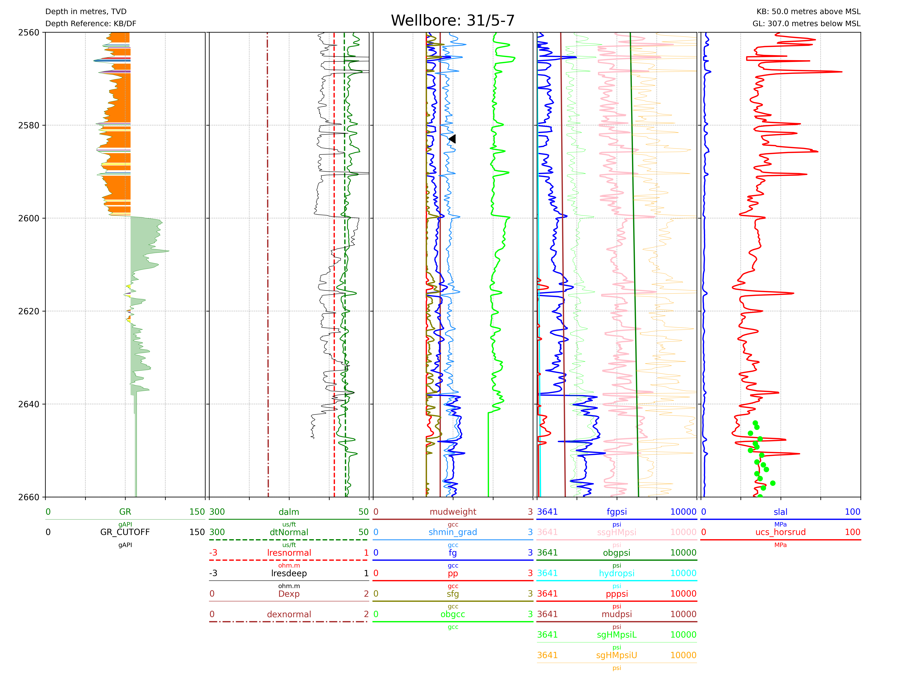
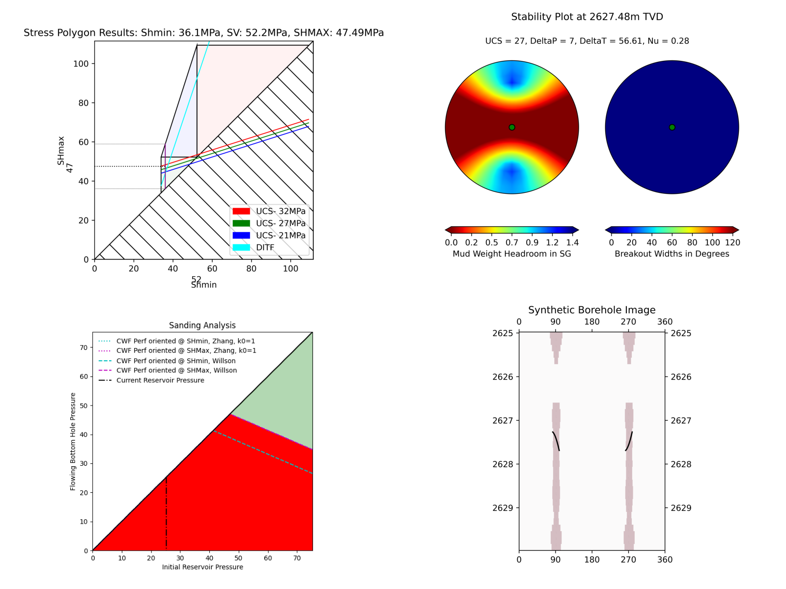

Real World Examples
-------------------

We wil now demonstrate two real world exaples, one vertical and one deviated well.
Let's do the vertical example first:
.. code-block:: python
    import stresslog as lst
    from welly import Well
    import pandas as pd

    # We thank Equinor for making the EOS Northern Lights dataset publicly available.
    # To obtain your own copy, please follow the guidelines on the Equinor Website
    # The las used here is created by splicing together two dlis files present in the original dataset

    vertwell = Well.from_las('northern_lights_31_5-7.las')

    formations = pd.read_csv('NorthernLights-31_5-7.csv')
    print(formations.head())
    print(list(formations))

    """
    Top TVD  Number                  Formation Name  ...  DXP_NCT  DXP_exp  DXP_ML
    0      488       1  URU(Upperregionalunconformity)  ...      NaN      NaN     NaN
    1      772       2                           Skade  ...      NaN      NaN     NaN
    2     1144       3              HordalandGreenClay  ...      NaN      NaN     NaN
    3     1442       4                          Balder  ...      NaN      NaN     NaN
    4     1530       5                            Sele  ...      NaN      NaN     NaN

    [5 rows x 24 columns]
    ['Top TVD', 'Number', 'Formation Name', 'GR Cut', 'Struc.Top', 'Struc.Bottom', 'CentroidRatio',
    'OWC', 'GOC', 'Coeff.Vol.Therm.Exp.', 'SHMax Azim.', 'SVDip', 'SVDipAzim', 'Tectonic Factor',
    'InterpretedSH/Sh', 'Biot', 'Dt_NCT', 'Dt_ML', 'Res_NCT', 'Res_Exp', 'Res_ML', 'DXP_NCT', 'DXP_exp', 'DXP_ML']
    """
    # The formations data, if provided, must contain 24 columns in this exact order.
    # If values are unavailable or we wish to use the defaults/constant values, it is fine to leave them blank

    ucs = pd.read_csv('UCSdata.csv')
    print(ucs.head())
    """
    2643.08  35
    0  2644.02  34
    1  2645.02  35
    2  2646.25  31
    3  2647.50  37
    4  2648.55  34
    """
    # The UCS data if provided, must be in MPa, with the depths in metres, TVD.

    attrib = [50, -307, 0, 0, 0, 100, 0, 0]

    wellwithoutdeviation = lst.getwelldev(wella=vertwell)
    # This is a vertical well, so we can use it without any deviation data.
    # Here we are setting the deviation data to be vertical (inc=azim=0)

    output = lst.compute_geomech(wellwithoutdeviation, attrib=attrib, rhoappg=17.33, lamb=0.00075,
                                forms = formations, UCSs=ucs, writeFile=True, user_home="./output",
                                offset=91, dip_dir=180, dip=2, doi=2627.5, mwvalues=[[1.26, 0.0, 0.0, 0.0, 0.0, 0]],
                                plotstart=2570,mudtemp=35)
    # Instead of plotting the entire well, we can also control the plot depths (Here we plot from 2570m down to the end of the data)
    # The real interesting thing in this calculation are the calculations at the depth of interest, 2627.5m
    # Let's check the "PlotAll.png" in the output/Stresslog_Plots to see the zobackogram, stability plot, hoop stresses and synthetic borehole image
    # Compare the "PlotBHI.png" to the actual image log of the EOS Northern Lights well

.. image:: ../Figures/overlay.png
   :alt: Overlay comparison with actual image log
   :width: 80%

.. code-block:: python
    # While the inbuilt plotting tools work, the main output is the dataframe (and the las string generated from the dataframe and other info)
    print(output[0])
    print(list(output[0]))
    """
                    DEPT           DTCO  ...  Shear_Modulus     Bulk_Modulus
    0         0.0000000000            NaN  ...   0.0000000000     0.0000000000
    1         0.1470000000            NaN  ...   0.0000000000     0.0000000000
    2         0.2940000000            NaN  ...   0.0000000000     0.0000000000
    3         0.4410000000            NaN  ...   0.0000000000     0.0000000000
    4         0.5880000000            NaN  ...   0.0000000000     0.0000000000
    ...                ...            ...  ...            ...              ...
    18922  2781.5339999988  87.2171899945  ...   1.8637329689  5133.1104753863
    18923  2781.6809999988  87.7187699958  ...   1.8287958424  4848.8212822883
    18924  2781.8279999988  88.2238099957  ...   1.7944750138  4796.3186612756
    18925  2781.9749999988  88.4480199981  ...   1.7795074291  4957.0108813337
    18926  2782.1219999988  88.3849000005  ...   0.0000000000     0.0000000000

    [18927 rows x 38 columns]
    ['DEPT', 'DTCO', 'DTSM', 'GR', 'NPHI', 'RLA1', 'RXO_HRLT', 'RHOZ', 'PEFLA',
    'MD', 'TVDM', 'INCL', 'AZIM', 'ShaleFlag', 'RHO', 'OBG_AMOCO', 'DTCT', 'PP_GRADIENT',
    'SHmin_DAINES', 'SHmin_ZOBACK', 'FracGrad', 'FracPressure', 'GEOPRESSURE', 'SHmin_PRESSURE', 'SHmax_PRESSURE',
    'MUD_PRESSURE', 'OVERBURDEN_PRESSURE', 'HYDROSTATIC_PRESSURE', 'MUD_GRADIENT', 'S0_Lal', 'S0_Lal_Phi', 'UCS_Horsud',
    'UCS_Lal', 'Poisson_Ratio', 'ML90', 'Youngs_Modulus', 'Shear_Modulus', 'Bulk_Modulus']
    """

    print(output[1][:2500])
    """
    ~Version ---------------------------------------------------
    VERS.   2.0 : CWLS log ASCII Standard -VERSION 2.0
    WRAP.    NO : One line per depth step
    DLM . SPACE : Column Data Section Delimiter
    ~Well ------------------------------------------------------
    STRT.m     0.00000 : 
    STOP.m  2782.12200 : 
    STEP.m     0.14700 : 
    NULL.      -999.25 : Null value
    UWI .       31/5-7 : 
    WELL.       31/5-7 : 
    SRVC. Schlumberger : 
    COMP.      Equinor : 
    FLD .          Eos : 
    ~Curve Information -----------------------------------------
    DEPT                .m      : 
    DTCO                .us/ft  : 
    DTSM                .us/ft  : 
    GR                  .gAPI   : 
    NPHI                .m3/m3  : 
    RLA1                .ohm.m  : 
    RXO_HRLT            .ohm.m  : 
    RHOZ                .g/cm3  : 
    PEFLA               .       : 
    MD                  .m      : 
    TVDM                .m      : 
    INCL                .       : 
    AZIM                .       : 
    ShaleFlag           .       : 
    RHO                 .gcc    : 
    OBG_AMOCO           .gcc    : 
    DTCT                .       : 
    PP_GRADIENT         .gcc    : 
    SHmin_DAINES        .gcc    : 
    SHmin_ZOBACK        .gcc    : 
    FracGrad            .gcc    : 
    FracPressure        .psi    : 
    GEOPRESSURE         .psi    : 
    SHmin_PRESSURE      .psi    : 
    SHmax_PRESSURE      .psi    : 
    MUD_PRESSURE        .psi    : 
    OVERBURDEN_PRESSURE .psi    : 
    HYDROSTATIC_PRESSURE.psi    : 
    MUD_GRADIENT        .gcc    : 
    S0_Lal              .       : 
    S0_Lal_Phi          .       : 
    UCS_Horsud          .mpa    : 
    UCS_Lal             .mpa    : 
    Poisson_Ratio       .       : 
    ML90                .gcc    : 
    Youngs_Modulus      .       : 
    Shear_Modulus       .       : 
    Bulk_Modulus        .       : 
    ~Params ----------------------------------------------------
    SMALL_RING     .in 8.0 : Caliper Calibration Small Ring
    CALI_LIN_OFFSET.m  0.0 : Caliper Linear Offset
    ~Other -----------------------------------------------------
    ~ASCII -----------------------------------------------------
        0.00000    -999.25    -999.25    -999.25    -999.25    -999.25    -999.25    -999.25    -999.25    0.00000    0.00000    0.00000    0.00000    0.00000    -999.25    -999.25   60.00000    -999.25    -999.25    1.48043    -999.25    -999.25  436.74626    -999.25    -999.25    0.00000    0.00000    0.00000    1.26000    0.00000    0.00000    0.00000    0.00000    0.25000    0.51126    0.00000    0.00000    0.00000
        0.14700    -999.25    -999.25    -999.25    -999.25    -999.25    -999.25    -999.25    -
    """
    # Had we decided to not save the files, the stress polygon, stability plot, hoop stress plot and syntheic borehole image would have been returned as base64 encoded string in the output tuple

.. code-block:: python

