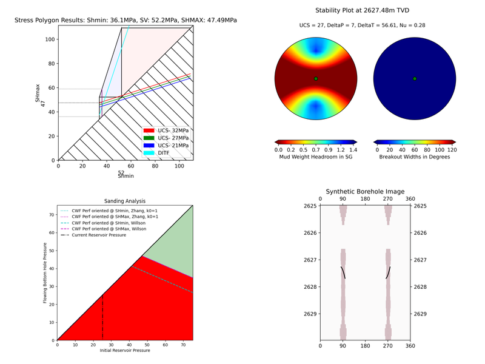

Real World Example: Eos Well
============================

This case study demonstrates the iterative process of geomechanical analysis using the Northern Lights dataset (courtesy of Equinor). We'll explore how different modeling assumptions affect our results and show the importance of calibrating models with observed data.

Initial Setup
-------------

First, let's explore the necessary environment setup and data structures:

.. code-block:: python

    import stresslog as lst
    from welly import Well
    import pandas as pd

Loading Well Data
-----------------

Here's how we load our well data and supporting datasets:

.. code-block:: python

    alias = {
        "sonic": ["none", "DTC", "DT24", "DTCO", "DT", "AC", "AAC", "DTHM"],
        "ssonic": ["none", "DTSM","DTSH_FINAL"],
        "gr": ["none", "GR", "GRD", "CGR", "GRR", "GRCFM","GR_EDTC"],
        "resdeep": ["none", "HDRS", "LLD", "M2RX", "MLR4C", "RD", "RT90", "RLA1", "RDEP", "RLLD", "RILD", "ILD", "RT_HRLT", "RACELM"],
        "resshal": ["none", "LLS", "HMRS", "M2R1", "RS", "RFOC", "ILM", "RSFL", "RMED", "RACEHM", "RXO_HRLT"],
        "density": ["none", "ZDEN", "RHOB", "RHOZ", "RHO", "DEN", "RHO8", "BDCFM"],
        "neutron": ["none", "CNCF", "NPHI", "NEU", "TNPH", "NPHI_LIM"],
        "pe": ["none", "PEFLA", "PEF8", "PE"]
    }

    # Load well log data
    string_las1 = lst.get_las_from_dlis('WL_RAW_AAC-ARLL-CAL-DEN-GR-NEU_RUN6_EWL_2.DLIS', aliases=alias, step=0.147)
    # we could have used aliases=None (which is the default) but that would have returned ALL the channels in the dlis creating a huge las file which slows the analysis somewhat.
    vertwell = Well.from_las(string_las1)
    # Load supporting data
    survey = pd.read_csv('Deviation.csv')
    formations = pd.read_csv('NorthernLights-31_5-7.csv')
    ucs = pd.read_csv('UCSdata.csv')
    print(ucs.head())
    """
      2643.08  35
    0  2644.02  34
    1  2645.02  35
    2  2646.25  31
    3  2647.50  37
    4  2648.55  34
    """

Iteration 1: Vertical Well
-----------------------------------------

Our first analysis assumes a vertical well:

.. code-block:: python

   # Set up mud KB, GL, BHT and LOT values
   attrib = [50, -307, 0, 0, 0, 100, 0, 0]
   xlot = [[1.43, 2582.9]]
   # Create vertical well model
   wellwithoutdeviation = lst.getwelldev(wella=vertwell, deva=None)
   # Run initial analysis
   output = lst.compute_geomech(
      wellwithoutdeviation, 
      attrib=attrib,
      rhoappg=17.33,
      a=0.8,
      lamb=0.00075,
      forms=formations,
      UCSs=ucs,
      writeFile=True,
      user_home="./output",
      offset=91,
      dip_dir=180,
      dip=2,
      doi=2627.5,
      mwvalues=[[1.26, 0.0, 0.0, 0.0, 0.0, 0]],
      plotstart=2560,
      plotend=2660,
      mudtemp=35,
      fracgradvals=xlot,
   )

   # Let's check the "PlotAll.png" in the output/Stresslog_Plots to see the zobackogram, stability plot, sanding risk plot and synthetic borehole image
   # Let's also compare the "PlotBHI.png" to the actual image log of the Northern Lights Eos well

   # While the inbuilt plotting tools work, the main output is the dataframe (and the las string generated from the dataframe and other info)
   
   print(output[0])
   print(list(output[0]))
   """
                     DEPT           DTCO  ...  Shear_Modulus     Bulk_Modulus
   0         0.0000000000            NaN  ...   0.0000000000     0.0000000000
   1         0.1470000000            NaN  ...   0.0000000000     0.0000000000
   2         0.2940000000            NaN  ...   0.0000000000     0.0000000000
   3         0.4410000000            NaN  ...   0.0000000000     0.0000000000
   4         0.5880000000            NaN  ...   0.0000000000     0.0000000000
   ...                ...            ...  ...            ...              ...
   18922  2781.5339999988  87.2171899945  ...   1.8637329689  5133.1104753863
   18923  2781.6809999988  87.7187699958  ...   1.8287958424  4848.8212822883
   18924  2781.8279999988  88.2238099957  ...   1.7944750138  4796.3186612756
   18925  2781.9749999988  88.4480199981  ...   1.7795074291  4957.0108813337
   18926  2782.1219999988  88.3849000005  ...   0.0000000000     0.0000000000

   [18927 rows x 38 columns]
   ['DEPT', 'DTCO', 'DTSM', 'GR', 'NPHI', 'RLA1', 'RXO_HRLT', 'RHOZ', 'PEFLA',
   'MD', 'TVDM', 'INCL', 'AZIM', 'ShaleFlag', 'RHO', 'OBG_AMOCO', 'DTCT', 'PP_GRADIENT',
   'SHmin_DAINES', 'SHmin_ZOBACK', 'FracGrad', 'FracPressure', 'GEOPRESSURE', 'SHmin_PRESSURE', 'SHmax_PRESSURE',
   'MUD_PRESSURE', 'OVERBURDEN_PRESSURE', 'HYDROSTATIC_PRESSURE', 'MUD_GRADIENT', 'S0_Lal', 'S0_Lal_Phi', 'UCS_Horsud',
   'UCS_Lal', 'Poisson_Ratio', 'ML90', 'Youngs_Modulus', 'Shear_Modulus', 'Bulk_Modulus']
   """

   print(output[1][:2500])
   """
   ~Version ---------------------------------------------------
   VERS.   2.0 : CWLS log ASCII Standard -VERSION 2.0
   WRAP.    NO : One line per depth step
   DLM . SPACE : Column Data Section Delimiter
   ~Well ------------------------------------------------------
   STRT.m     0.00000 : 
   STOP.m  2782.12200 : 
   STEP.m     0.14700 : 
   NULL.      -999.25 : Null value
   UWI .       31/5-7 : 
   WELL.       31/5-7 : 
   SRVC. Schlumberger : 
   COMP.      Equinor : 
   FLD .          Eos : 
   ~Curve Information -----------------------------------------
   DEPT                .m      : 
   DTCO                .us/ft  : 
   DTSM                .us/ft  : 
   GR                  .gAPI   : 
   NPHI                .m3/m3  : 
   RLA1                .ohm.m  : 
   RXO_HRLT            .ohm.m  : 
   RHOZ                .g/cm3  : 
   PEFLA               .       : 
   MD                  .m      : 
   TVDM                .m      : 
   INCL                .       : 
   AZIM                .       : 
   ShaleFlag           .       : 
   RHO                 .gcc    : 
   OBG_AMOCO           .gcc    : 
   DTCT                .       : 
   PP_GRADIENT         .gcc    : 
   SHmin_DAINES        .gcc    : 
   SHmin_ZOBACK        .gcc    : 
   FracGrad            .gcc    : 
   FracPressure        .psi    : 
   GEOPRESSURE         .psi    : 
   SHmin_PRESSURE      .psi    : 
   SHmax_PRESSURE      .psi    : 
   MUD_PRESSURE        .psi    : 
   OVERBURDEN_PRESSURE .psi    : 
   HYDROSTATIC_PRESSURE.psi    : 
   MUD_GRADIENT        .gcc    : 
   S0_Lal              .       : 
   S0_Lal_Phi          .       : 
   UCS_Horsud          .mpa    : 
   UCS_Lal             .mpa    : 
   Poisson_Ratio       .       : 
   ML90                .gcc    : 
   Youngs_Modulus      .       : 
   Shear_Modulus       .       : 
   Bulk_Modulus        .       : 
   ~Params ----------------------------------------------------
   SMALL_RING     .in 8.0 : Caliper Calibration Small Ring
   CALI_LIN_OFFSET.m  0.0 : Caliper Linear Offset
   ~Other -----------------------------------------------------
   ~ASCII -----------------------------------------------------
      0.00000    -999.25    -999.25    -999.25    -999.25    -999.25    -999.25    -999.25    -999.25    0.00000    0.00000    0.00000    0.00000    0.00000    -999.25    -999.25   60.00000    -999.25    -999.25    1.48043    -999.25    -999.25  436.74626    -999.25    -999.25    0.00000    0.00000    0.00000    1.26000    0.00000    0.00000    0.00000    0.00000    0.25000    0.51126    0.00000    0.00000    0.00000
      0.14700    -999.25    -999.25    -999.25    -999.25    -999.25    -999.25    -999.25    -
   """

In this first run, we've made several key assumptions:

- The well is perfectly vertical
- The SHmax azimuth is 91 degrees
-The stress tensor is tilted 2 degrees to the south

The results can be found in the ./output/Stresslog_Plots directory, where PlotAll.png shows the Zobackogram, stability plot, sanding risk plot, and synthetic borehole image.

.. image:: ../Figures/WellPlot.png
   :alt: Well Plot
   :width: 600px
   :align: center

.. image:: ../Figures/overlay.png
   :alt: Overlay Plot
   :width: 600px
   :align: center

Iteration 2: Incorporating Well Deviation
-----------------------------------------------

Looking at the survey data, we notice that the well isn't perfectly vertical. At 2621.97m, there's a slight deviation with an inclination of 0.60° at an azimuth of 40.11°. Could this slight departure from verticality explain the en-echelon fractures we observe?

.. code-block:: python

    # Create deviated well model
    wellwithdeviation = lst.getwelldev(wella=Well.from_las(string_las1), deva=survey)
    # Run analysis with deviation but no stress tensor tilt
    output = lst.compute_geomech(
        wellwithdeviation,
        attrib=attrib,
        rhoappg=17.33,
        lamb=0.00075,
        forms=formations,
        UCSs=ucs,
        writeFile=True,
        user_home="./output0",
        offset=91,
        dip_dir=180,
        dip=0,
        doi=2627.5,
        mwvalues=[[1.26, 0.0, 0.0, 0.0, 0.0, 0]],
        plotstart=2560,
        plotend=2660,
        mudtemp=35,
        fracgradvals=xlot
    )

.. image:: ../Figures/resized/PlotBHI1.png
   :alt: BHI Plot
   :width: 600px
   :align: center

We observe that this model produces fractures with closure directions opposite to what we see in the actual image logs. This suggests our assumption about well deviation being the primary factor might be incorrect.

Iteration 3: Reintroducing Stress Tensor Tilt
------------------------------------------------------

Let's try reintroducing the stress tensor tilt while keeping the well deviation:

.. code-block:: python

    output = lst.compute_geomech(
        wellwithdeviation,
        attrib=attrib,
        rhoappg=17.33,
        lamb=0.00075,
        forms=formations,
        UCSs=ucs,
        writeFile=True,
        user_home="./output1",
        offset=91,
        dip_dir=180,
        dip=2,
        doi=2627.5,
        mwvalues=[[1.26, 0.0, 0.0, 0.0, 0.0, 0]],
        plotstart=2560,
        plotend=2660,
        mudtemp=35,
        fracgradvals=xlot
    )

.. image:: ../Figures/resized/PlotBHI2.png
   :alt: BHI Plot
   :width: 600px
   :align: center

This corrects the closure direction, but now the fracture alignment is incorrect. The results suggest we need an SHmax azimuth above 100°, closer to 120°.

Iteration 4: Using Log-Derived SHmax Azimuth
-----------------------------------------------------

Digging deeper into the log data, we discover there's actually a proxy for SHmax azimuth in the log itself:

.. code-block:: python

    # Extract SHmax azimuth from log data
    y = lst.get_dlis_data('WL_RAW_AAC-ARLL-CAL-DEN-GR-NEU_RUN6_EWL_2.DLIS')
    z = y[0]["FSH_AZIM_OVERALL"]
    unwrapped_z = z.where(z >= 0, z + 180)

    # Plot the azimuth values
    from matplotlib import pyplot as plt
    plt.plot(unwrapped_z)
    plt.savefig('SHmax_Azim.png')

These values are significantly different from the regional database values. Nevertheless, let us try the indicated value 114°:

.. code-block:: python

    output = lst.compute_geomech(
        wellwithdeviation,
        attrib=attrib,
        rhoappg=17.33,
        lamb=0.00075,
        forms=formations,
        UCSs=ucs,
        writeFile=True,
        user_home="./output2",
        offset=114,
        dip_dir=180,
        dip=2,
        doi=2627.5,
        mwvalues=[[1.26, 0.0, 0.0, 0.0, 0.0, 0]],
        plotstart=2560,
        plotend=2660,
        mudtemp=35,
        fracgradvals=xlot,
        ten_fac=0
    )

.. image:: ../Figures/resized/PlotBHI3.png
   :alt: BHI Plot
   :width: 600px
   :align: center

How about the maximum value of 124°? Clearly this is stretching things quite some, totally unrealistic I think. Here goes:

.. code-block:: python

    output = lst.compute_geomech(
        wellwithdeviation,
        attrib=attrib,
        rhoappg=17.33,
        lamb=0.00075,
        forms=formations,
        UCSs=ucs,
        writeFile=True,
        user_home="./output2",
        offset=124,
        dip_dir=180,
        dip=2,
        doi=2627.5,
        mwvalues=[[1.26, 0.0, 0.0, 0.0, 0.0, 0]],
        plotstart=2560,
        plotend=2660,
        mudtemp=35,
        fracgradvals=xlot,
        ten_fac=0
    )

Discussion
--------------------------

There are some important caveats to consider:

- The SHmax_Azim values in the log actually range from 90° to 125° in the interval containing the fractures.
- If these varying azimuths were accurate, we would expect to see considerable variation in fracture position, which is not observed in the data.

This case study illustrates the complexity of real-world geomechanical analysis.
Which model (if any) better describes reality is left upto the geological sensibility of the reader.