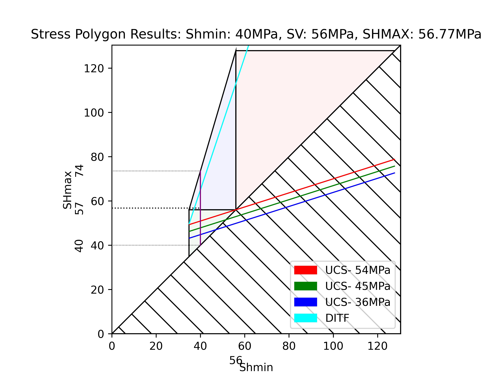
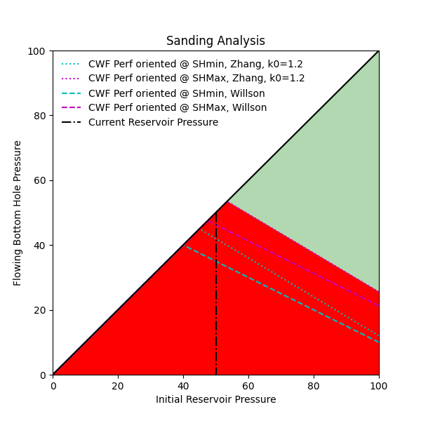

Turorial
========

Installation
------------

To install **Stresslog**, ensure you have Python 3.10 or 3.11 installed. You can install the package using `pip`:

.. code-block:: bash

    pip install stresslog

Development
-----------

For developers and pythonistas, you can download the repository from github and install from source as follows:

.. code-block:: bash

   # Clone the repository
   git clone https://github.com/GeoArkadeep/Stresslog.git

   # Change to the project directory
   cd Stresslog

   # Install in editable mode
   pip install -e .

   # Run tests
   # Currently only pytest is required for testing
   pip install -r ./tests/test-requirements.txt
   pytest

Basic Usage
-----------

Below is a basic example demonstrating how to use **Stresslog** to perform geomechanical analysis on a well log:

.. code-block:: python

    import stresslog as lst
    from welly import Well

    # Load your well data from a LAS file

    well = Well.from_las('path/to/your/well.las', index='m')

    # Simplest use case: Vertical well with no deviation data at full resolution (will take a fairly long time, enough for a coffee break)
    # This will also write config and output files to the default directories (by default ~/Documents/Stresslog_Config, ~/Documents/Stresslog_Data and ~/Documents/Stresslog_Plots).
    # If you don't want that, set writeFile=False and writeConfig=False, this will skip writing files and creating directories
    # This will assume all the optional parameters are at their default settings
    # It is necessary for the depth to be in metres. setting index='m' makes welly automatically convert the unit to metres, even if the original las has them in feet
    # It is possible later to convert the units back to feet (and not just the depth but all calculated units can be changed to suit your needs) but this is not demonstrated here

    output = lst.compute_geomech(well)

    # The 'output' contains the following:
    # - output[0]: Well log DataFrame (original and computed values) with mnemonics as headers
    # - output[1]: LAS file as StringIO object containing original and computed values
    # - output[2] to output[6]: Base64 encoded plot strings for properties calculated at depth of interest (or None if written to files or not calculated at doi=0)
    # - output[7]: Depth of Interest as specified (in meters)
    # - output[8]: Welly object containing all data

.. code-block:: python

    # If deviation data is available:
    import pandas as pd

    # Ensure first three columns are MD, inclination, azimuth
    deviation_data = pd.read_csv('path/to/deviation_data.csv')

    # Next we create a new welly object by combining the original welly object and the deviation data
    # Instead of the welly object, we can also pass the las file directly as a stringIO object using the parameter string_las)
    # We can also resample the welly object at this step. Here we resample it to every 10 metres

    wellwithdeviation = lst.getwelldev(wella=well,deva=deviation_data,step=10)

    # Define well attributes (e.g., KB, GL, etc.)
    attrib = [30, -120, 0, 0, 0, 0, 0, 0]  # Customize as needed

    # Perform geomechanical analysis. This time it will return much faster (takes about five seconds on my pc, your milage may vary)
    output = lst.compute_geomech(wellwithdeviation, attrib=attrib, writeFile=False)

In this example:

- We load a well from a LAS file using the `welly` library.
- Deviation data is added to the well object. The deviation data should be provided as a DataFrame with columns: measured depth, inclination, and azimuth, in that order.
- Well attributes are defined in the `attrib` list. These attributes can include parameters like Kelly Bushing (KB) height, Ground Level (GL), and others as required.
- The `compute_geomech` function is called to perform the geomechanical analysis. The `writeFile` parameter is set to `False` to prevent writing output to files.
- If interactive plots during the process are desired, we can set `display` parameter to `True` which will also set `writeFile` to `True` internally. This will then display the well plot, as well as other plots at the depth of interest, if any.
- For a comprehensive list of parameters for 'compute_geomech', please refer to the API documentation.

Standalone Functions
--------------------

While the package is mainly designed to perform complete calculations on entire wells, there are some functions which can be called independently to help with geomechanics in general.
These include:

- drawSP

.. code-block:: python

    lst.drawSP(56,26,29,40,UCS=45,path="polygon.png")

- getSP

.. code-block:: python

    x = lst.getSP(56,26,29,40,UCS=45)
    print(x)
    
[40, 69.6719983666802, 54.8359991833401]

- plot_sanding

.. code-block:: python

    lst.plot_sanding(sigmamax=60, sigmamin=25,sigma_axial=55, pp=50, ucs=45, k0=1.2, nu=0.25, biot=1, path="sanding.png")

- and many more (refer to API documentation for more)
