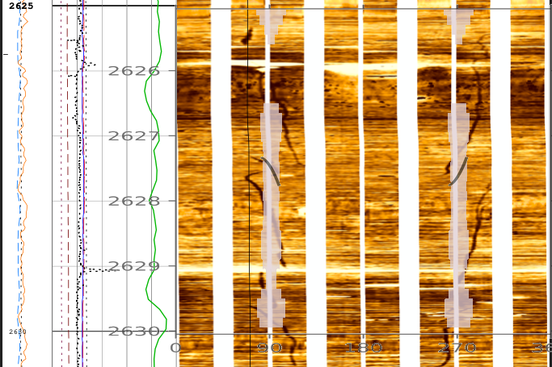

# Summary

This package is meant to be used by researchers and practitioners working in the field of geomechanics. It uses a collection of algorithms used to iteratively model the sate of stress underground, given a well log. The computations use 6 component stress tensor, as calculated using [@pevska1995], which allows modeling of inclined wellbores in inclined states of stress. Under the hood, Stresslog uses [@SciPy] for optimizations, dlisio and welly to handle well .dlis files and .las files (and other well data), respectively.

# Statement of need

Open-source packages exist, such as [@Yu2018], but this as well as most commercial software (JewelSuite by Baker Hughes being a notable exception) assume a vertical stress state. Stresslog differs from these by aiming to be comprehensive: allowing modeling of variable Biot's coefficient, thermal stresses and inclined stress states, operating on standard well log formats, and with built-in support for log aliasing.

Stresslog has been designed to help with pre-drill, post-drill and realtime geomechanical calculations. It is aimed at empowering researchers with a 1D mechanical earth modeling tool that is freely available and which researchers can modify to apply their own methods when necessary, while allowing practitioners to use industry-standard algorithms to calculate solutions and export well log data.

# Methodology

Overburden gradient [@traugott1997], pore-pressure [@Zhang20132; @Flemings2021], minimum horizontal stress [@Daines1982; @zoback1992], rock strength [@lal1999; @horsrud2001] and other parameters are calculated considering the given well-logging, deviation, and formation data. The maximum horizontal stress is estimated by applying stress-polygon [@ZOBACK2003] for every depth-sample. Borehole image interpretation is considered in the stress-polygon results if available.

The calculation of tilted stress states using the given methodology requires the Euler angles $\alpha$, $\beta$ and $\gamma$. We calculate the Euler angles from geological data in terms of tilt of the stress tensor, as follows:

$$
\text{Tilt Azimuth} = \tan^{-1}\left(\frac{R_{s_{3,2}}}{R_{s_{3,1}}}\right)
$$

$$
\text{Tilt Angle} = \cos^{-1}(R_{s_{3,3}})
$$

Where $R_s$ is the rotation matrix defined by Euler angles $\alpha$, $\beta$ and $\gamma$, in the NED reference frame.

Considering the azimuth of maximum principal stress as $\alpha$, the above relations are used to optimize for the angles $\beta$ and $\gamma$. The technique proposed by [@pevska1995] starts with good estimates of the far field principal stresses, $\sigma_1$, $\sigma_2$ and $\sigma_3$, already rotated by the Euler Angles $\alpha$, $\beta$ and $\gamma$. Usually, however, what is available is an estimate of minimum horizontal stress, an estimate of the vertical stress, and an estimate of maximum horizontal stress. It is insufficient to simply rotate the tensor, as the rotated tensor will not have the correct vertical component. We optimize the principal stresses ($\sigma_1$, $\sigma_2$ and $\sigma_3$) such that the vertical and horizontal components of the tensor match the specified vertical and horizontal stresses.

For every depth-sample, the stresses resolved on the wellbore wall are calculated along the circumference. The lower critical mudweight is calculated by using the modified Lade formula [@ewy1999] for critical mudweight during this process. A closed-form solution has been derived by setting $\sigma_{\theta_{\min}}$ equal to tensile stress and solving this for the upper critical mud pressure, as follows:

$\text{FracturePressure}_{\text{non-penetrating}} =$
$$
\frac{
  \left(
  \begin{aligned}
    &\quad +2\, \sigma_{B_{1,1}}'^2\, \nu\, \cos(2\theta_{min})
      - 4\, \sigma_{B_{1,1}}'^2\, \nu\, \cos(2\theta_{min})^2
      + 4\, \sigma_{B_{1,1}}'\, \sigma_{B_{1,2}}'\, \nu\, \sin(2\theta_{min})\\[1mm]
    &\quad - 8\, \sigma_{B_{1,1}}'\, \sigma_{B_{1,2}}'\, \nu\, \sin(4\theta_{min})
      + 8\, \sigma_{B_{1,1}}'\, \sigma_{B_{2,2}}'\, \nu\, \cos(2\theta_{min})^2
      + 2\, \sigma_{B_{1,1}}'\, \sigma_{B_{3,3}}'\, \cos(2\theta_{min})\\[1mm]
    &\quad - \sigma_{B_{1,1}}'\, \sigma_{B_{3,3}}'
      + 2\, \sigma_{B_{1,1}}'\, \nu\, PP\, \cos(2\theta_{min})
      - 2\, \sigma_{B_{1,1}}'\, \nu\, \sigma_T\, \cos(2\theta_{min})\\[1mm]
    &\quad - 2\, \sigma_{B_{1,1}}'\, \nu\, TS\, \cos(2\theta_{min})
      - 2\, \sigma_{B_{1,1}}'\, TS\, \cos(2\theta_{min})
      + \sigma_{B_{1,1}}'\, TS\\[1mm]
    &\quad - 16\, \sigma_{B_{1,2}}'^2\, \nu\, \sin(2\theta_{min})^2
      + 4\, \sigma_{B_{1,2}}'\, \sigma_{B_{2,2}}'\, \nu\, \sin(2\theta_{min})
      + 8\, \sigma_{B_{1,2}}'\, \sigma_{B_{2,2}}'\, \nu\, \sin(4\theta_{min})\\[1mm]
    &\quad + 4\, \sigma_{B_{1,2}}'\, \sigma_{B_{3,3}}'\, \sin(2\theta_{min})
      + 4\, \sigma_{B_{1,2}}'\, \nu\, PP\, \sin(2\theta_{min})
      - 4\, \sigma_{B_{1,2}}'\, \nu\, \sigma_T\, \sin(2\theta_{min})\\[1mm]
    &\quad - 4\, \sigma_{B_{1,2}}'\, \nu\, TS\, \sin(2\theta_{min})
      - 4\, \sigma_{B_{1,2}}'\, TS\, \sin(2\theta_{min})
      + 4\, \sigma_{B_{1,3}}'^2\, \sin(\theta_{min})^2\\[1mm]
    &\quad - 4\, \sigma_{B_{1,3}}'\, \sigma_{B_{2,3}}'\, \sin(2\theta_{min})
      - 4\, \sigma_{B_{2,2}}'^2\, \nu\, \cos(2\theta_{min})^2
      - 2\, \sigma_{B_{2,2}}'^2\, \nu\, \cos(2\theta_{min})\\[1mm]
    &\quad - 2\, \sigma_{B_{2,2}}'\, \sigma_{B_{3,3}}'\, \cos(2\theta_{min})
      - \sigma_{B_{2,2}}'\, \sigma_{B_{3,3}}'
      - 2\, \sigma_{B_{2,2}}'\, \nu\, PP\, \cos(2\theta_{min})\\[1mm]
    &\quad + 2\, \sigma_{B_{2,2}}'\, \nu\, \sigma_T\, \cos(2\theta_{min})
      + 2\, \sigma_{B_{2,2}}'\, \nu\, TS\, \cos(2\theta_{min})
      + 2\, \sigma_{B_{2,2}}'\, TS\, \cos(2\theta_{min})\\[1mm]
    &\quad + \sigma_{B_{2,2}}'\, TS
      + 4\, \sigma_{B_{2,3}}'^2\, \cos(\theta_{min})^2
      - \sigma_{B_{3,3}}'\, PP\\[1mm]
    &\quad + \sigma_{B_{3,3}}'\, \sigma_T
      + \sigma_{B_{3,3}}'\, TS
      + PP\, TS
      - \sigma_T\, TS
      - TS^2
  \end{aligned}
  \right)
}{
  2\, \sigma_{B_{1,1}}'\, \nu\, \cos(2\theta_{min})
  + 4\, \sigma_{B_{1,2}}'\, \nu\, \sin(2\theta_{min})
  - 2\, \sigma_{B_{2,2}}'\, \nu\, \cos(2\theta_{min})
  - \sigma_{B_{3,3}}'
  + TS
}
$$

where $\sigma'_B$ is the effective stress tensor in the borehole frame of reference, PP is pore-pressure, TS is tensile strength, $\nu$ is Poisson's ratio, $\sigma_T$ is thermal stress and $\theta_{\min}$ is the circumferential angle corresponding to minimum hoop stress.

If the user specifies an analysis depth, an orientation-stability plot is calculated at that depth. Synthetic image of the wellbore wall is prepared for 5 metres around the analysis depth. Other plots are also calculated at the analysis depth, including sanding prediction [@willson2002; @Zhang2007].

For pre-drill forecast, the function get_analog() can be used to derive a log-prediction from nearby post-drill well by interpolation using formation tops.

From observations on multiple wells sampling the same stress field at different wellbore orientations, a better estimate of the stress tensor is possible [@thorsen2011].

# Case Study

The well data from Equinor Northern Lights dataset [@northernlights] has been used as the example here, to model the stress state occurring in the depth interval of 2600 to 2630m. The resistivity image log shows the occurrence of en-echelon fractures in a vertical wellbore. The model applied here uses parameters similar to [@Thompson2022], and a stress tensor tilt of 2 degrees towards south, and is able to replicate the fracture patterns observed in the actual image log.

It is not being suggested that this interpretation of the data is preferred over any other, the analysis by [@Thompson2022] is much more comprehensive.

# Disclosure
No funding/financial support of any form was involved in the creation of this work.

# References